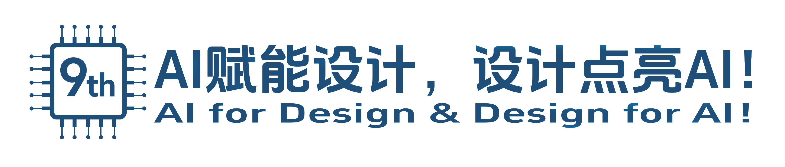

# 智能手语眼镜配置工具

[](LICENSE)

[简体中文](README.md) | [English](README.en.md)

智能手语眼镜配置工具 (SignLang Eyes Configurator) 是一个基于 Vue3 及 Web Bluetooth 的手语识别设备配置台。它用于通过蓝牙连接 [智能手语眼镜](https://github.com/syxxzzr/signlang-eyes) 设备，查看实时手部关键点流、展示识别结果、录制手势样本，并管理设备端手势库

> [](https://www.socchina.net/)

> 本项目是为第九届[全国大学生嵌入式芯片与系统设计竞赛](https://www.socchina.net/)参赛作品 `基于RK3588的智能实时手语翻译和危险声音预警系统` 设计的智能手语眼镜配置工具，主要用于与智能眼镜设备进行蓝牙通讯，实现实时查看手语识别结果与动态增加/删除手语的功能

> 本分支专为第九届[全国大学生嵌入式芯片与系统设计竞赛](https://www.socchina.net/)参赛作品 `基于RK3588的智能实时手语翻译和危险声音预警系统` 做了UI微调，与 `master` 分支仅有UI与说明文档上的细微区别

> 第九届[全国大学生嵌入式芯片与系统设计竞赛](https://www.socchina.net/)参赛作品 `基于RK3588的智能实时手语翻译和危险声音预警系统` 设备端代码同样完全开源，仓库地址位于 [https://github.com/syxxzzr/signlang-eyes](https://github.com/syxxzzr/signlang-eyes)

> 你可以通过以下链接访问我们部署在 Cloudflare Pages 服务下的 Demo
> - [https://signlang-eyes-configurator.soc-race.syxxzzr.eu.org](https://signlang-eyes-configurator.soc-race.syxxzzr.eu.org)
> - [https://signlang-eyes-configurator.pages.dev](https://signlang-eyes-configurator.pages.dev)

## 本地开发

本项目使用 `pnpm` 作为包管理工具，因此开发环境中需要安装好 `pnpm`

安装依赖：

```sh
pnpm install
```

启动开发服务器：

```sh
pnpm run dev
```

生产构建：

```sh
pnpm run build
```

## 使用 Cloudflare Pages 部署

本项目是一个 Serverless 网页服务，因此可方便地通过 Cloudflare Pages 服务进行全球部署

### 通过 Git 仓库部署
详细部署教程可参考 https://developers.cloudflare.com/pages/get-started/git-integration/

### 通过 Cloudflare Wrangler 工具部署

项目同时提供了对使用 `Wrangler` 工具进行部署的支持，具体可参考如下命令：

```sh
pnpm run pages:preview
```

构建并部署到 Cloudflare Pages：

```sh
pnpm run pages:deploy
```

---

部署完成后，Cloudflare Pages 会提供一个默认的 `*.pages.dev` 域名以供访问。

> 在部分地区，默认 *.pages.dev 域名可能无法正常访问，因此可以使用 Cloudflare 官方支持的自定义域名功能

## 特别鸣谢

- [Vue](https://github.com/vuejs/core)
- [Vite](https://github.com/vitejs/vite)
- [TypeScript](https://github.com/microsoft/TypeScript)
- [Pinia](https://github.com/vuejs/pinia)
- [Vue I18n](https://github.com/intlify/vue-i18n)
- [VueUse](https://github.com/vueuse/vueuse)
- [Tailwind CSS](https://github.com/tailwindlabs/tailwindcss)
- [shadcn-vue](https://github.com/unovue/shadcn-vue)
- [Reka UI](https://github.com/unovue/reka-ui)
- [Lucide](https://github.com/lucide-icons/lucide)
- [vue-sonner](https://github.com/xiaoluoboding/vue-sonner)
- [Vitest](https://github.com/vitest-dev/vitest)
- [Wrangler](https://github.com/cloudflare/workers-sdk)
- [Cloudflare Pages](https://pages.cloudflare.com/)
- [Shields.io](https://github.com/badges/shields)
